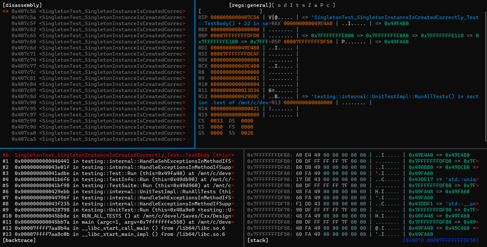

# Debugging With Voltron

---

### Introduction

Voltron is a useful debugger. Check it out!

---

### Installation

See ... https://github.com/snare/voltron/tree/master for more info.

---

### Windows Terminal Hotkeys

ALT + SHIFT + "+" -> split the window horizontally
ALT + SHIFT + "-" -> split the window vertically

---

### Voltron Commands

    voltron v bt -- view backtrace
    voltron v d -- view disassembly
    voltron v r -- view registers
    voltron v s -- view stack

---

### Use in Windows with WSL

This tool is especially useful, because you can use it in Windows with WSL. 

The idea is, for example, you're working on a project in CLion, or another IDE, and you use WSL as
your toolchain. When you launch the debugger to debug stuff with CLion, for example, you can view 
all of the views in Voltron while stepping through the code with CLion. 

---

